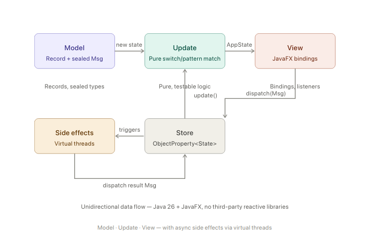

# Implementing Reactive, Event-Driven MVU Architecture in JavaFX with Java 26

**To:** Engineering Team
**Subject:** Architecture Guide — MVU with Java 26 + JavaFX (no third-party reactive libraries)

Primary implementation reference: [RouterFX JavaFX App Unified Architecture](./javafx-unified-architecture.md)
Boundary outcome contract reference: [RouterFX Result Pattern at Boundaries](./router-result-pattern.md)

## Overview

This memo describes how to implement a clean Model-View-Update (MVU) architecture in JavaFX using only Java 26 and the JavaFX SDK. The pattern enforces unidirectional data flow, immutable state, and predictable rendering — without requiring RxJava, Reactor, or any other reactive library. All reactive primitives needed are already present in the JDK and JavaFX.



## Layer 1 — Model: Immutable State and Messages

The model layer has two responsibilities: representing application state as an immutable snapshot, and defining all possible events (messages) the system can respond to.

Use Java **records** for state. Records are shallow-immutable by default, provide structural equality, and read cleanly. Ensure collections inside records use `List.copyOf()` to prevent mutation.

```java
public record AppState(
    int count,
    String status,
    List<String> items
) {
    public AppState {
        items = List.copyOf(items); // defensive copy
    }
}
```

Use **sealed interfaces with nested records** to define your message types. The compiler enforces exhaustiveness — if you add a new message type and forget to handle it in `update()`, it is a compile error, not a runtime surprise.

```java
public sealed interface Msg permits
    Msg.Increment, Msg.Decrement, Msg.ItemAdded, Msg.ItemsLoaded {

    record Increment()                    implements Msg {}
    record Decrement()                    implements Msg {}
    record ItemAdded(String item)         implements Msg {}
    record ItemsLoaded(List<String> items) implements Msg {}
}
```

## Layer 2 — Update: Pure State Transitions

The `update()` function is the entire business logic of the application. It takes the current state and a message, and returns a new state. It must have **no side effects** — no I/O, no UI calls, no threading. This makes it trivially unit-testable.

```java
public class Update {
    public static AppState update(AppState state, Msg msg) {
        return switch (msg) {
            case Msg.Increment()          -> new AppState(state.count() + 1, "incremented", state.items());
            case Msg.Decrement()          -> new AppState(state.count() - 1, "decremented", state.items());
            case Msg.ItemAdded(var item)  -> new AppState(
                                                state.count(),
                                                "item added",
                                                Stream.concat(state.items().stream(), Stream.of(item)).toList()
                                            );
            case Msg.ItemsLoaded(var all) -> new AppState(state.count(), "loaded", all);
        };
    }
}
```

Pattern matching on sealed types also lets you destructure message payloads inline (as shown with `ItemAdded` and `ItemsLoaded`), eliminating boilerplate getters.

## Layer 3 — Store: The Reactive Backbone

The `Store` is the single source of truth. It holds state in a JavaFX `ObjectProperty<AppState>`, which is already an observable container. Any listener registered on it will be notified automatically when state changes — this is JavaFX's built-in reactive primitive.

```java
public class Store {
    private final ObjectProperty<AppState> state =
        new SimpleObjectProperty<>(new AppState(0, "ready", List.of()));

    public void dispatch(Msg msg) {
        // All state mutations must happen on the JavaFX Application Thread
        Platform.runLater(() -> state.set(Update.update(state.get(), msg)));
    }

    public ReadOnlyObjectProperty<AppState> stateProperty() {
        return state;
    }

    public AppState getState() {
        return state.get();
    }
}
```

Expose only `ReadOnlyObjectProperty` to the outside world. Views can observe state, but only the store can write it. This is the boundary that enforces unidirectional flow.

## Layer 4 — View: Declarative Bindings

Views observe the store's state property and update UI elements reactively. JavaFX's `ObservableValue.map()` (available since JavaFX 19) lets you project specific fields from state into bindings without manual listeners.

```java
public class CounterView {
    private final Store store;

    public CounterView(Store store) { this.store = store; }

    public Node build() {
        Label countLabel = new Label();
        Label statusLabel = new Label();
        Button incBtn = new Button("+");
        Button decBtn = new Button("−");
        Button loadBtn = new Button("Load items");

        // Derive bindings directly from projected state fields
        countLabel.textProperty().bind(
            store.stateProperty().map(s -> String.valueOf(s.count()))
        );
        statusLabel.textProperty().bind(
            store.stateProperty().map(AppState::status)
        );

        // Events dispatch messages — no logic here
        incBtn.setOnAction(e -> store.dispatch(new Msg.Increment()));
        decBtn.setOnAction(e -> store.dispatch(new Msg.Decrement()));
        loadBtn.setOnAction(e -> store.dispatchAsync(new Msg.ItemsLoaded(List.of())));

        return new VBox(10, countLabel, statusLabel, incBtn, decBtn, loadBtn);
    }
}
```

Views contain zero business logic. They translate state into UI and user gestures into messages.

## Handling Async Side Effects with Virtual Threads

Some messages trigger I/O — API calls, database queries, file reads. These must never block the JavaFX Application Thread. Virtual threads (GA since Java 21) handle this without callbacks or schedulers.

The pattern is: dispatch a message to trigger the effect, run the I/O on a virtual thread, then dispatch the result as a new message. The `Platform.runLater()` inside `dispatch()` handles the thread boundary automatically.

```java
public class Store {

    // Async dispatch: runs the side effect off the UI thread, then feeds result back
    public void dispatchAsync(Supplier<Msg> sideEffect) {
        Thread.ofVirtual().start(() -> {
            Msg result = sideEffect.get();  // I/O happens here, off UI thread
            dispatch(result);               // Platform.runLater() is inside dispatch()
        });
    }
}
```

At the call site in the view:

```java
loadBtn.setOnAction(e ->
    store.dispatchAsync(() -> {
        List<String> items = itemRepository.fetchAll();  // blocking I/O — fine on virtual thread
        return new Msg.ItemsLoaded(items);
    })
);
```

For more complex multi-step effects (parallel API calls, fan-out/fan-in), use `StructuredTaskScope`:

```java
store.dispatchAsync(() -> {
    try (var scope = new StructuredTaskScope.ShutdownOnFailure()) {
        var userTask  = scope.fork(() -> userService.fetch(id));
        var itemsTask = scope.fork(() -> itemService.fetchAll(id));
        scope.join().throwIfFailed();
        return new Msg.DashboardLoaded(userTask.get(), itemsTask.get());
    } catch (Exception e) {
        return new Msg.LoadFailed(e.getMessage());
    }
});
```

## Boundary Outcomes with Result

For RouterFX IO boundaries, represent expected runtime failures as `Result<T>`, not thrown transport exceptions.

```java
routerApi.login(credentials, challenge).fold(
    session -> {
        dispatch(new Msg.LoginSucceeded(session));
        return 0;
    },
    fault -> {
        dispatch(new Msg.LoginFailed(fault));
        return 0;
    }
);
```

This keeps failure handling explicit in effects and keeps `update()` exception-free.

## Wiring It All Together

The application entry point creates one store, one view, and connects them:

```java
public class App extends Application {

    @Override
    public void start(Stage stage) {
        Store store = new Store();
        CounterView view = new CounterView(store);

        Scene scene = new Scene(new BorderPane(view.build()), 400, 300);
        stage.setScene(scene);
        stage.setTitle("MVU Demo");
        stage.show();
    }

    public static void main(String[] args) { launch(args); }
}
```

The store is typically a singleton or passed by constructor injection. Avoid passing it through deeply nested view hierarchies — prefer scoping sub-views to the parts of state they actually need, using `store.stateProperty().map(...)` to narrow the observable.

## Key Design Rules

There are four rules that, if followed consistently, prevent the architecture from degrading:

**State is always in the store.** No state lives in view fields, static variables, or caches outside `AppState`. If the view needs it, it belongs in the model.

**Views never call `update()` directly.** All state changes go through `store.dispatch()`. This is what keeps the flow unidirectional.

**`update()` has no side effects.** It is a pure function. Pass a state and a message in, get a new state out. Nothing else happens. Testing it requires no JavaFX runtime, no mocks, no threads.

**Side effects always produce messages.** Async work completes by dispatching a message back to the store. It never mutates state directly, and it never touches the UI directly.

## Summary

Java 26 and JavaFX provide everything needed for a production-quality MVU application. Records and sealed interfaces give you a type-safe, immutable model layer. `ObjectProperty<AppState>` serves as the reactive state container. `ObservableValue.map()` and `Bindings` replace reactive operators for view projection. Virtual threads and `StructuredTaskScope` replace schedulers and `flatMap` chains for async side effects. The result is an architecture that is simpler to debug, easier to test, and requires no external reactive framework.
